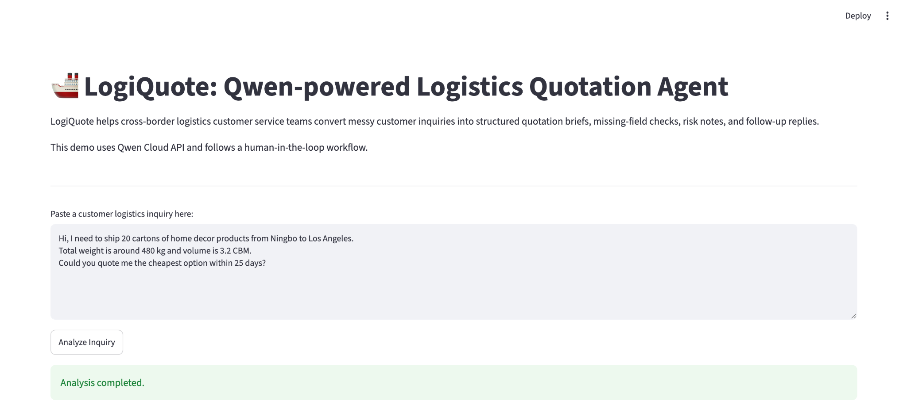
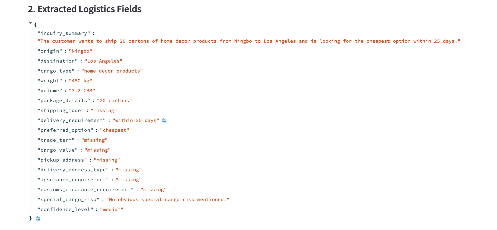

# LogiQuote: AI Agent for Logistics Quotation Preparation

LogiQuote is an AI agent portfolio project that helps cross-border logistics customer service teams convert messy customer inquiries into structured quotation preparation materials.

The system extracts key shipment fields, detects missing or unclear information, identifies potential quotation risks, and generates human-reviewable follow-up reply drafts. It is designed to support logistics staff during the early quotation preparation stage, rather than replacing human decision-making or generating final prices automatically.

## Project Type

Independent AI Agent Portfolio Project

This project demonstrates my ability to design and implement an AI-assisted workflow for a real business scenario, including problem framing, prompt design, structured output design, agent workflow development, Streamlit prototyping, demo mode design, and batch evaluation.

## Problem

Cross-border logistics customer service teams often receive incomplete and unstructured quotation inquiries from customers.

A customer may mention the origin, destination, cargo type, weight, volume, delivery deadline, or preferred shipping option in different formats. However, important information such as pickup address, destination type, trade term, cargo value, customs clearance requirement, packaging details, and insurance requirement may be missing.

Before preparing a quotation, logistics staff usually need to:

1. Read the customer message carefully.
2. Extract key shipment information.
3. Identify missing or unclear fields.
4. Check potential risks.
5. Ask follow-up questions before preparing a quotation.

This process is repetitive, time-consuming, and may lead to inconsistent communication if handled manually every time.

## Solution

LogiQuote transforms messy logistics inquiries into a structured and reviewable AI-assisted workflow.

The agent can:

1. Extract key shipment fields from unstructured customer inquiries.
2. Detect missing or unclear information required for quotation preparation.
3. Generate risk and clarification notes.
4. Produce professional customer follow-up reply drafts.
5. Provide an internal quotation preparation brief.
6. Keep human staff in control through a human-in-the-loop review process.

The goal is not to automatically send quotations, but to reduce repetitive preparation work and help customer service staff respond more consistently.

## System Architecture


**Figure 1. LogiQuote system architecture.** The system uses a Streamlit frontend, a modular LogiQuote agent workflow, and Qwen Cloud API to transform messy logistics inquiries into structured quotation briefs, missing-field checks, risk notes, reply drafts, and human-reviewable outputs.

## Demo Preview

### 1. Customer Inquiry Input

The Streamlit interface allows logistics staff to paste a messy customer inquiry and start the AI-assisted quotation preparation workflow.



### 2. Structured Field Extraction

LogiQuote extracts key shipment information such as origin, destination, cargo type, weight, volume, package details, delivery requirement, and preferred option.



### 3. Missing Field Check and Risk Notes

The agent identifies missing or unclear quotation fields, provides risk notes, and recommends the next action before quotation preparation.


Additional screenshots, including customer reply draft and follow-up questions, are available in `docs/screenshots/`.

## Key Features

* **Inquiry Summary**
  Summarizes the customer's logistics request in a concise way.

* **Structured Quotation Form**
  Extracts fields such as origin, destination, cargo type, weight, volume, package details, preferred shipping option, delivery requirement, and trade term.

* **Missing Field Detection**
  Identifies missing or unclear information needed before quotation preparation.

* **Risk and Clarification Notes**
  Flags possible issues such as unclear destination type, DDP requirements, battery-related goods, incomplete cargo details, or missing cargo value.

* **Customer Reply Draft**
  Generates a professional follow-up message that customer service staff can review and edit.

* **Internal Operation Notes**
  Provides internal notes to help logistics staff understand what needs to be confirmed before preparing a quotation.

* **Demo Mode Without API Key**
  Allows reviewers to explore the workflow using saved sample outputs from `data/batch_test_results.json` without configuring a Qwen API key.

* **Live Qwen API Mode**
  Allows users with a valid Qwen Cloud API key to run the agent with real-time model responses.

* **Human-in-the-loop Review**
  The generated response is not automatically sent to the customer. Human review is required before any communication or quotation decision.

## Tech Stack

* Python
* Streamlit
* Qwen Cloud API
* JSON structured output
* Prompt engineering
* Modular agent workflow
* Batch testing
* GitHub documentation

## Repository Structure

```text
logiquote-qwen-agent/
├── README.md
├── LICENSE
├── requirements.txt
├── .env.example
├── app.py
├── qwen_client.py
├── agent_workflow.py
├── test_extraction.py
├── test_workflow.py
├── test_batch.py
├── prompts/
│   ├── extraction_prompt.md
│   ├── missing_fields_prompt.md
│   └── reply_generation_prompt.md
├── data/
│   ├── sample_inquiries.json
│   ├── field_schema.json
│   └── batch_test_results.json
├── docs/
│   ├── project_story.md
│   ├── evaluation_summary.md
│   ├── architecture.md
│   ├── architecture_diagram.png
│   └── screenshots/
│       ├── demo_input.png
│       ├── demo_extraction.png
│       ├── demo_missing_check.png
│       └── demo_reply_followup.png
└── deployment/
    └── alibaba_cloud_deployment.md
```

## How It Works

The LogiQuote workflow contains three main AI processing stages:

### 1. Field Extraction

The agent reads the original customer inquiry and extracts structured logistics fields, including:

* Origin
* Destination
* Cargo type
* Weight
* Volume
* Package details
* Shipping mode
* Delivery requirement
* Preferred option
* Trade term
* Cargo value
* Pickup address
* Delivery address type
* Insurance requirement
* Customs clearance requirement
* Special cargo risk
* Confidence level

### 2. Missing Field and Risk Check

The agent reviews the extracted fields and identifies:

* Missing required fields
* Unclear information
* Possible risk points
* Whether the inquiry is ready for quotation preparation
* Recommended next action

### 3. Reply Generation

The agent generates:

* A customer follow-up reply draft
* Follow-up questions
* Internal operation notes

The final output is designed for human review before any message is sent to the customer.

## Example Use Case

Customer inquiry:

> Hi, I need to ship 20 cartons of home decor products from Ningbo to Los Angeles. Total weight is around 480 kg and volume is 3.2 CBM. Could you quote me the cheapest option within 25 days?

LogiQuote extracts:

* Origin: Ningbo
* Destination: Los Angeles
* Cargo type: Home decor products
* Weight: 480 kg
* Volume: 3.2 CBM
* Package details: 20 cartons
* Preferred option: Cheapest
* Delivery requirement: Within 25 days

It also detects missing information such as:

* Exact pickup address
* Delivery address type
* Trade term
* Cargo value
* Insurance requirement
* Customs clearance requirement
* Preferred shipping mode

Then it generates follow-up questions and a customer reply draft for logistics staff to review.

## Evaluation

The project includes batch testing with sample logistics inquiries in both English and Chinese.

The evaluation covers different scenarios, including:

| Case   | Language | Scenario                                                  | Main Evaluation Focus                                              |
| ------ | -------- | --------------------------------------------------------- | ------------------------------------------------------------------ |
| Case 1 | English  | Standard shipment inquiry from Ningbo to Los Angeles      | Basic field extraction and missing field detection                 |
| Case 2 | Chinese  | Bluetooth speakers from Shenzhen to a US Amazon warehouse | Chinese input handling and destination type clarification          |
| Case 3 | English  | DDP quote for LED lights from Guangzhou to Toronto        | Trade term detection and risk clarification                        |
| Case 4 | English  | Furniture sea freight from Foshan to Sydney               | Shipping mode preference and cargo detail extraction               |
| Case 5 | Chinese  | Highly incomplete inquiry to Germany                      | Low-information inquiry handling and follow-up question generation |

Batch test results are saved in:

```text
data/batch_test_results.json
```

A detailed evaluation summary is available in:

```text
docs/evaluation_summary.md
```

## How to Run Locally

### 1. Clone the repository

```bash
git clone https://github.com/luyuhao-wq/logiquote-qwen-agent.git
cd logiquote-qwen-agent
```

### 2. Install dependencies

```bash
pip install -r requirements.txt
```

### 3. Create a local `.env` file

Create a `.env` file in the project root directory:

```text
DASHSCOPE_API_KEY=your_dashscope_api_key_here
QWEN_BASE_URL=https://dashscope-intl.aliyuncs.com/compatible-mode/v1
QWEN_MODEL=qwen-plus
```

Do not upload the `.env` file to GitHub.

### 4. Run the Streamlit app

```bash
streamlit run app.py
```

By default, the Streamlit app supports **Demo Mode**, which loads saved sample outputs from `data/batch_test_results.json`. This allows reviewers to explore the workflow without configuring a Qwen API key.

Users who have a valid Qwen Cloud API key can switch to **Live Qwen API Mode** in the sidebar and run the agent with real-time model responses.

### 5. Run workflow tests

```bash
python test_workflow.py
```

### 6. Run batch evaluation

```bash
python test_batch.py
```

## Running Modes

### Demo Mode

Demo Mode is designed for portfolio reviewers who want to understand the workflow without setting up API credentials.

It loads saved results from:

```text
data/batch_test_results.json
```

This mode demonstrates:

* Original inquiry display
* Structured field extraction
* Missing field check
* Risk notes
* Customer reply draft
* Follow-up questions
* Internal operation notes

### Live Qwen API Mode

Live Qwen API Mode calls Qwen Cloud API in real time.

This mode requires a valid local `.env` file with:

```text
DASHSCOPE_API_KEY
QWEN_BASE_URL
QWEN_MODEL
```

The `.env` file should remain local and should not be committed to GitHub.

## Project Status

Current version completed:

* Qwen Cloud API integration
* Modular AI agent workflow
* Streamlit demo
* Demo Mode without API key
* Live Qwen API Mode
* Structured JSON field extraction
* Missing field detection
* Risk and clarification analysis
* Customer reply draft generation
* Batch testing with sample inquiries
* Architecture documentation
* Demo screenshots
* Evaluation summary

Planned improvements:

* Add a portfolio case study document
* Improve the frontend interface for clearer business presentation
* Add export function for quotation preparation briefs
* Connect with a mock logistics pricing database
* Expand evaluation with more real-world inquiry examples
* Add lightweight cloud deployment using Streamlit Community Cloud, Render, or Hugging Face Spaces

## Limitations

LogiQuote is a prototype for quotation preparation support. It does not generate final logistics prices or replace professional logistics judgment.

Current limitations include:

* No real carrier pricing database
* No customs rule database
* No live shipment tracking API
* No customer account history
* Limited sample evaluation size
* AI-generated outputs still require human review

## Portfolio Value

This project demonstrates:

* AI product thinking for a real business workflow
* Prompt engineering for structured output
* Modular AI agent workflow design
* Human-in-the-loop AI system design
* Streamlit-based prototype development
* Demo mode design for portfolio reviewers
* Evaluation with multilingual sample inquiries
* Documentation for technical and product audiences

## Future Improvements

* Add customer history and preference memory
* Connect with real logistics quotation databases
* Support more shipping modes and destination rules
* Add multilingual frontend support
* Add dashboard-style quotation preparation view
* Add CRM or PDF export
* Add confidence scoring and manual correction feedback loop

## Author

Yuhao Lu
BSc Computer Science and Technology
Xiamen University Malaysia
