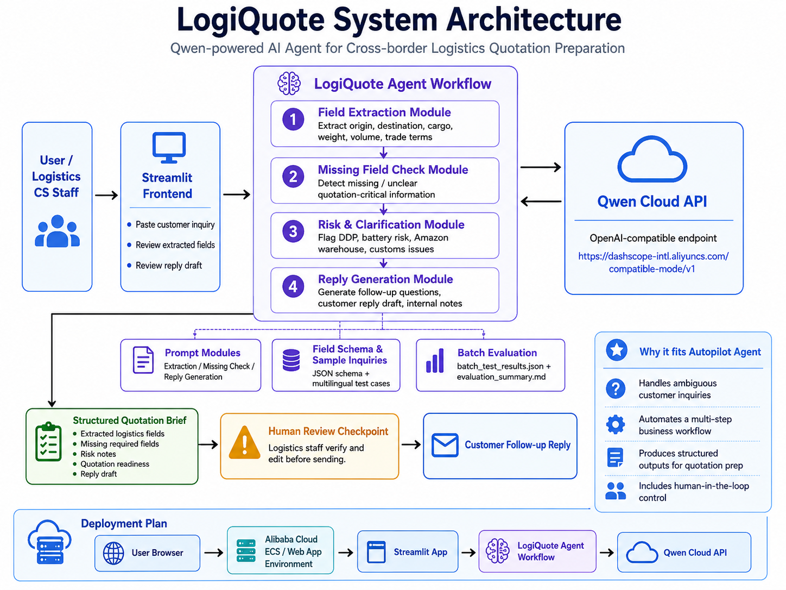

# System Architecture

## Overview

LogiQuote is a Qwen-powered AI agent designed for cross-border logistics quotation preparation.

The system converts messy customer inquiries into structured quotation briefs through a multi-step AI workflow:

1. Customer inquiry input
2. Field extraction
3. Missing field detection
4. Risk and clarification analysis
5. Customer reply generation
6. Human review checkpoint

This architecture is designed for the **Autopilot Agent** track because it automates a real-world business workflow while keeping human staff in control before any customer-facing response is sent.

---
## Architecture Flow



**Figure 1. LogiQuote system architecture.** This diagram shows how the Streamlit frontend, LogiQuote agent workflow, Qwen Cloud API, supporting prompt/data modules, human review checkpoint, and planned Alibaba Cloud deployment are connected.

The core workflow can also be summarized as:

```text
Customer / Logistics CS Staff
        |
        v
Streamlit Frontend
        |
        v
LogiQuote Agent Workflow
        |
        |---- Field Extraction Module
        |---- Missing Field Check Module
        |---- Risk and Clarification Module
        |---- Reply Generation Module
        |
        v
Qwen Cloud API
        |
        v
Structured Quotation Brief
        |
        v
Human Review Checkpoint
        |
        v
Customer Follow-up Reply
```

The diagram highlights that LogiQuote is not a simple chatbot. It is a modular AI workflow that converts ambiguous customer inquiries into structured, reviewable quotation preparation outputs.

---

## Main Components

### 1. Streamlit Frontend

The Streamlit frontend provides a simple user interface where logistics customer service staff can paste a customer inquiry.

The frontend displays:

* Original inquiry
* Extracted logistics fields
* Missing required fields
* Risk notes
* Recommended next action
* Customer reply draft
* Follow-up questions
* Internal operation notes
* Full JSON output

The interface is designed for fast review, testing, and demo presentation.

---

### 2. LogiQuote Agent Workflow

The workflow is implemented in `agent_workflow.py`.

It contains three main stages:

#### Field Extraction

Function:

```python
extract_fields(customer_inquiry)
```

This module uses `prompts/extraction_prompt.md` to extract structured quotation fields from the customer inquiry.

Example fields include:

* origin
* destination
* cargo type
* weight
* volume
* package details
* shipping mode
* delivery requirement
* preferred option
* trade term
* cargo value
* pickup address
* delivery address type
* insurance requirement
* customs clearance requirement
* special cargo risk

#### Missing Field Check

Function:

```python
check_missing_fields(extracted_fields)
```

This module uses `prompts/missing_fields_prompt.md` to identify missing or unclear information required before a quotation can be prepared.

It also generates risk notes and quotation readiness status.

Possible readiness statuses include:

* `ready_for_initial_estimate`
* `needs_follow_up_before_quote`
* `insufficient_information`

#### Reply Generation

Function:

```python
generate_reply(customer_inquiry, extracted_fields, missing_check)
```

This module uses `prompts/reply_generation_prompt.md` to generate:

* customer reply draft
* follow-up questions
* internal operation notes

The generated reply is not sent automatically. It must be reviewed by logistics staff first.

---

### 3. Qwen Cloud API Layer

The Qwen Cloud API is called through `qwen_client.py`.

The project uses the OpenAI-compatible Qwen Cloud endpoint:

```text
https://dashscope-intl.aliyuncs.com/compatible-mode/v1
```

Environment variables are managed through `.env` locally and `.env.example` in the repository.

Example environment variables:

```text
DASHSCOPE_API_KEY=your_dashscope_api_key_here
QWEN_BASE_URL=https://dashscope-intl.aliyuncs.com/compatible-mode/v1
QWEN_MODEL=qwen-plus
```

The real API key is stored only in the local `.env` file and is not uploaded to GitHub.

---

### 4. Prompt Modules

The prompt logic is separated into modular files:

```text
prompts/
├── extraction_prompt.md
├── missing_fields_prompt.md
└── reply_generation_prompt.md
```

This modular design makes the workflow easier to test, maintain, and improve.

Each prompt has a specific role:

* `extraction_prompt.md`: extracts structured logistics fields from messy customer inquiries.
* `missing_fields_prompt.md`: checks missing or unclear information and identifies risk notes.
* `reply_generation_prompt.md`: generates customer follow-up replies and internal operation notes.

---

### 5. Data and Evaluation

Sample test cases are stored in:

```text
data/sample_inquiries.json
```

Batch test results are stored in:

```text
data/batch_test_results.json
```

The batch test script is:

```text
test_batch.py
```

The evaluation summary is documented in:

```text
docs/evaluation_summary.md
```

The evaluation covers:

* English logistics inquiries
* Chinese logistics inquiries
* Amazon warehouse delivery
* DDP quotation requirements
* Battery-related product risk
* Furniture sea freight
* Highly incomplete customer inquiries

---

## Human-in-the-loop Design

LogiQuote is not designed to directly send messages or generate final shipping prices.

Instead, it supports customer service staff by preparing structured information and draft replies.

The human review checkpoint ensures that:

* Staff can verify extracted information.
* Staff can edit the generated customer reply.
* Staff can decide whether more details are needed.
* The system avoids unsafe or inaccurate automatic quotation.

This design is important for logistics workflows because quotation accuracy depends on real operational constraints, customer-specific details, carrier availability, customs requirements, and pricing databases.

---

## Error Handling and Production Considerations

The current prototype includes JSON response cleaning in `agent_workflow.py`.

Because LLMs may return JSON wrapped in Markdown code blocks, the workflow includes a cleaning step before parsing the response.

Future production improvements may include:

* More robust JSON validation
* Retry logic for failed API calls
* Logging for each workflow step
* User authentication
* Database storage for customer history
* Connection with real carrier rate tables
* More precise product risk classification
* Alibaba Cloud deployment monitoring

---

## Local Runtime Flow

The current local demo runs with Streamlit.

```text
User Browser
    |
    v
Local Streamlit App
    |
    v
LogiQuote Agent Workflow
    |
    v
Qwen Cloud API
    |
    v
Structured Output and Human Review UI
```

The local demo can be started with:

```bash
streamlit run app.py
```

or:

```bash
python3 -m streamlit run app.py
```

---

## Planned Alibaba Cloud Deployment

For the hackathon submission, the project will be deployed on Alibaba Cloud.

The planned deployment approach is:

```text
User Browser
    |
    v
Alibaba Cloud ECS / Web App Environment
    |
    v
Streamlit App
    |
    v
LogiQuote Agent Workflow
    |
    v
Qwen Cloud API
```

Deployment proof will be documented in:

```text
deployment/alibaba_cloud_deployment.md
```

The final Devpost submission will include:

* Public GitHub repository
* Alibaba Cloud deployment proof
* Architecture diagram
* Public demo video
* Project description
* Selected track: Autopilot Agent

---

## Why This Architecture Fits the Autopilot Agent Track

The Autopilot Agent track focuses on agents that automate real-world business workflows from start to finish.

LogiQuote fits this track because it handles a practical logistics customer service workflow:

```text
Messy customer inquiry
    |
    v
Structured field extraction
    |
    v
Missing information detection
    |
    v
Risk and clarification analysis
    |
    v
Customer reply draft
    |
    v
Human review
```

The system handles ambiguous input, performs multi-step reasoning, produces structured outputs, and includes a human-in-the-loop checkpoint before any customer-facing action is taken.
